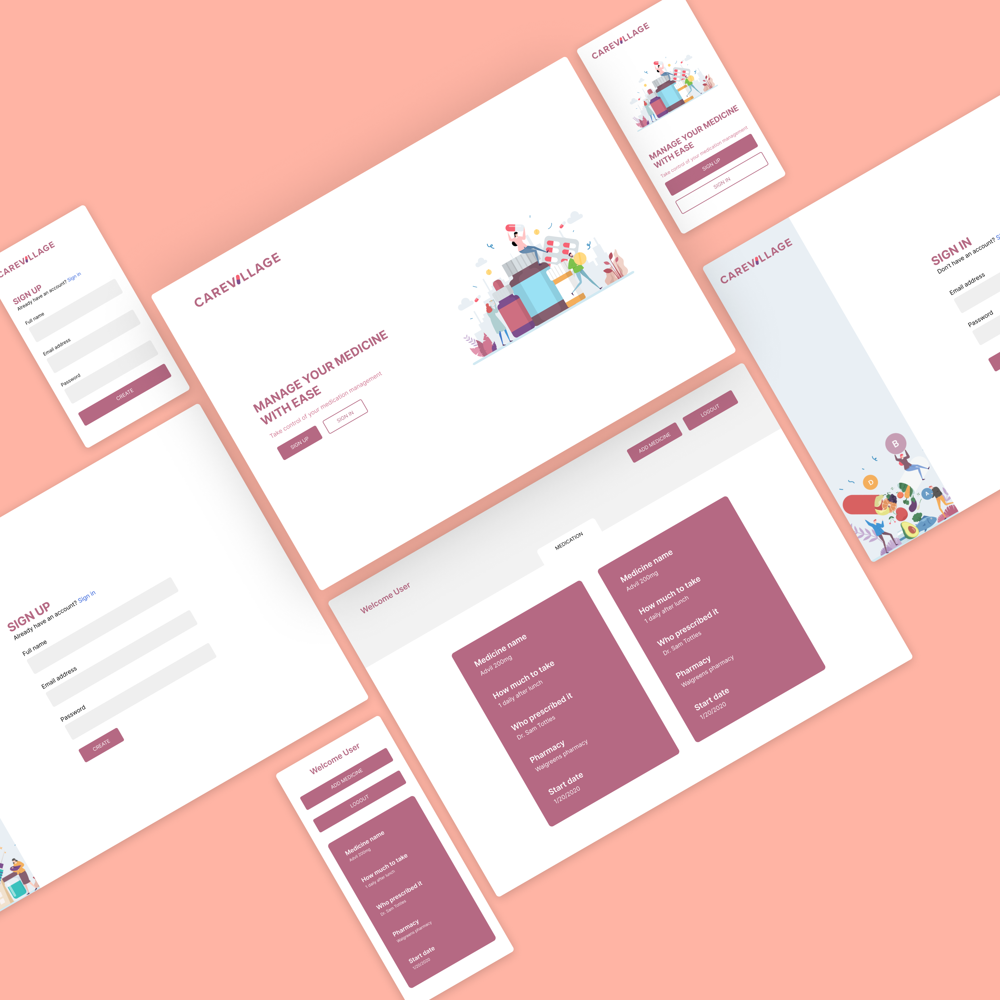

# Carevillage

  It is easy to pile up on medicines you need to take and forget what you may have taken previously. Hence I built carevillage to keep track of all your medicine. 

## Demo

- [Live Demo](https://quickpokedex.netlify.com/)
~may take a few extra seconds to load as it is running on free heroku dyno

		Email: test@email.com
		Password: test1234

## Development Process

I always start of by jolting down ideas to develop. Once I have a few ideas, I will select the one that interests me and I can find real case use for.
Next I move onto sketching down application features and design. Once I have an idea of how I want the application to look, I move onto ***Figma*** to design the UI for my application. I design both mobile and desktop versions.
After my design goes through different iterations and is complete, I move onto development and spend the next few weeks, developing and pulling my hair out fixing bugs :P

*Below is the final UI design I had finished.*

  

  

## Technology Used

  

#### Frontend

- ***HTML***
- ***CSS***
- ***Vanilla JS***

#### Backend

- ***Node.js*** for backend development
- ***Express*** as backend web framework
- ***MongoDB*** as database
- ***Bcrypt*** for encrypting user passwords
- ***Json Web Token*** for securing protected endpoints

  

  

## THANK YOU